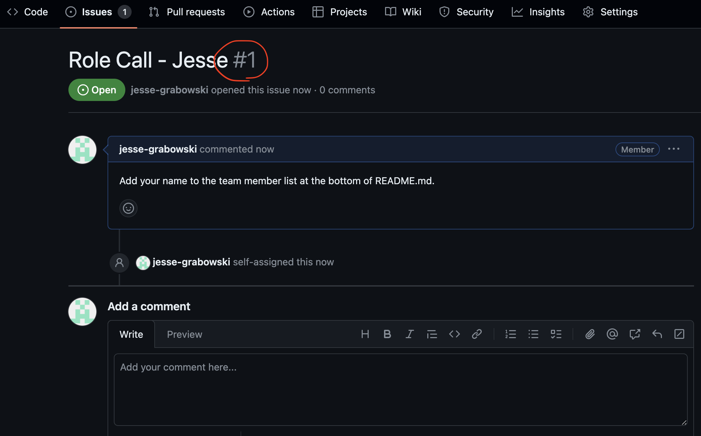

# New Team Member Onboarding

## Prerequisites

### Visual Git Client (Optional)

If you are not familiar with `git`, it may be beneficial to use a visual client for managing your changes. Atlassian Sourcetree is a reasonably easy to use option, although you may explore for other options. This guide will assume you are using Sourcetree.

https://www.sourcetreeapp.com/

### Homebrew

Homebrew is a package manage for MacOS applications. You may have experience with this (we used it for OpenCV in Programming Practice 1); if this is already installed on your system you do not need to do it again.

https://brew.sh/

## Cloning This Repo

Navigate to this repo in github and copy the ssh url from the `<> Code` dropdown.


Open sourcetree and clone a new repository from a url.


Enter the project url, decide where you want to put it in your filesystem, and click Clone.


You should now be able to navigate the repo using your editor of choice (I recommend IntelliJ IDEA).

## Adding Your Name to the Team

Navigate to the `Issues` tab in the github repository (or click the below link).

https://github.com/PBL3-2024/onboarding/issues

Locate your `Role Call - <Name>` ticket and open it. Make a note of the ticket number (`#123`, see below)



Open `README.md` in your cloned repo and scroll to the bottom. Add your nickname to the list (this repository is public, DO NOT include your full name or student id).

Note that the syntax is important - your name must be on the next available line and preceded by an asterisk. See https://github.github.com/gfm/ for more information on `Markdown`.


Open Sourcetree and ensure that you are looking at the onboarding repository. In the top left corner, click the `Commit` button. Ensure that `README.md` is selected. Enter a commit message describing what you did, prefixed by the number from your github issue. For example:

```text
#1 Add name to README.md
```


Press the `Commit` button in the bottom right corner.

Press the `Push` button near the top of the window. Ensure that `main` is selected, then press `Ok`.


Congratulations, you are now ready to start using git and github. You should be able to see your changes reflected in the github repository page. You may now mark your ticket as completed.


## Team Members

* Jesse
* Andy m
* Hiroyuki YAMABE
* Hikaru
* Replace this with your name
* Replace this with your name
* Replace this with your name

